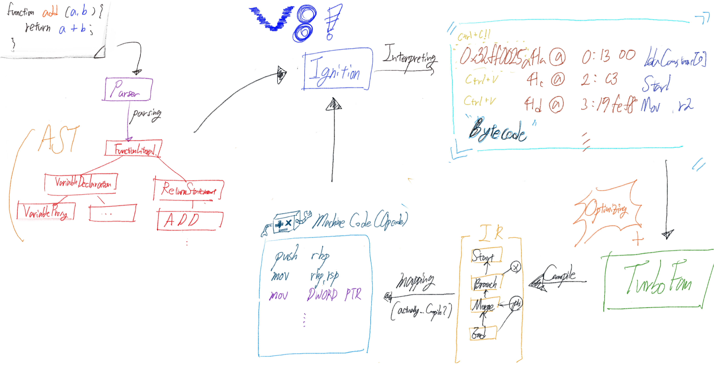
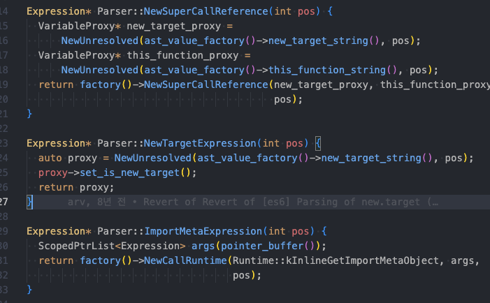
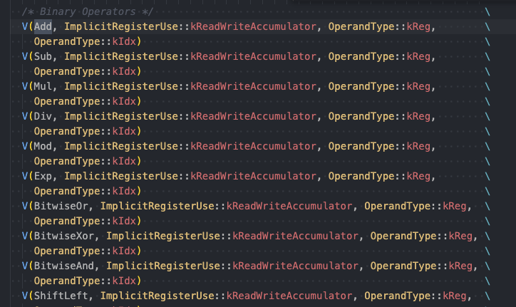
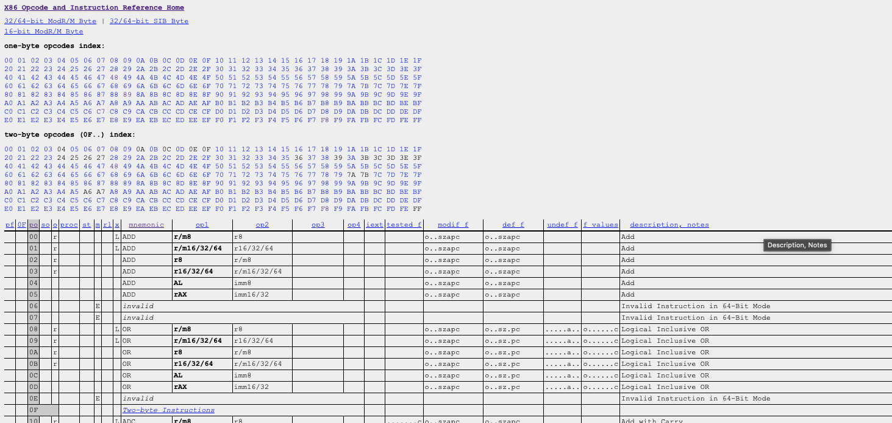
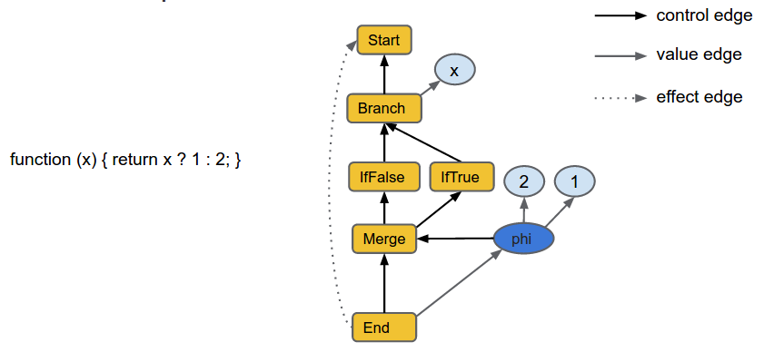
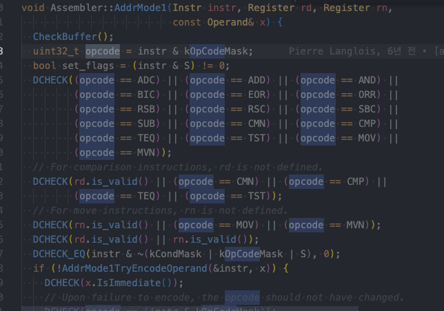
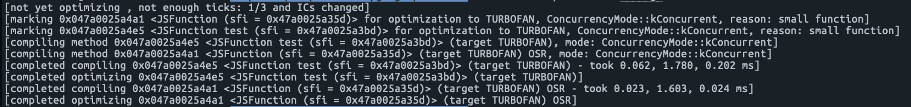

이 글에서는 널리 알려진 V8의 구조에 대해 알아봅니다. V8 이 어떤 구성요소로 이루어져 있고, 각 요소별 역할을 소개합니다. 현재 V8의 모든 부분을 알고 있지 않기 때문에, 소스 코드와 문서를 통해 알아본 내용이라 할지라도 틀린 부분이 있을 수 있습니다.

## 1. V8 이란?

V8은 구글에서 공개한 오픈 소스 자바스크립트 엔진입니다. 구글에서 제공하는 웹 서비스들에서 겪고 있는 성능 문제를 해결하기 위해 개발되었습니다. C++ 로 구현되었습니다.

### 히스토리

- 2008.09: V8 첫버전 공개
- 2015: TurboFan 공개
- 2016: Ignition 공개
- 2017: Ignition 과 TurboFan 의 새로운 파이프라인도입
- 2017: V8 5.9 버전부터는 Full-codegren 과 Crankshaft 더 이상 사용되지 않음

## 2. V8 설치해보기

**V8 은 자체적으로 실행이 가능한 프로그램이 아닙니다.** 따라서 V8 을 테스트 하기 위해서는 [임베딩이 필요합니다](https://v8.dev/docs/embed). 그 과정이 다소 복잡하고 기본 구조를 알아내는데에는 d8 을 사용하는것으로 충분하여, V8을 임베딩해서 내부 구현을 알아보는 과정을 다음으로 미룹니다.

**[d8](https://source.chromium.org/chromium/chromium/src/+/main:v8/src/d8/) 이란** V8의 developer shell 입니다. V8의 동작이나 새롭게 추가된 자바스크립트 기능을 테스트 해볼 수 있는 도구입니다. 저희는 [V8 의 동작을 디버깅하기 위해서 사용합니다.](https://v8.dev/docs/d8)

d8과 v8 이 오픈소스이지만 단순히 소스코드를 `git pull` 로 받아올 수 없습니다. 그래서 이 [문서](https://gist.github.com/kevincennis/0cd2138c78a07412ef21)를 참조하여 설치합니다.

## 3. V8 의 구조



## 4. V8 의 동작 방식

각 요소별 동작방식은 Parser, Ignition, TurboFan 요소별로 다른 문서로 상세히 설명할 예정입니다. 이 문서에서는 간략하게 요소별 역할과 개념만 소개합니다.

### 4-1. Parser

JS 코드를 파싱해서 추상 구문 트리(AST, Abstract Syntax Tree)를 생성합니다. V8 JS 코드를 실행하기까지 걸리는 시간에서 JS 를 파싱하는 과정도 꽤 많은 부분을 차지합니다.

파싱시간을 최적화하는 코드작성법, Parser 의 자세한 동작 과정은 이 글에서는 소개하지 않고, Parser 를 거쳤을 때 생성되는 AST 만 예시로 보겠습니다.

- `d8 --print-ast` 파라미터를 이용하면 AST 를 출력해줍니다.

**[JS code]**

```jsx
function add(a, b) {
  return a + b;
}

const result = add(1, 3);
```

**[AST]**

```jsx
FUNC at 12
. KIND 0
. LITERAL ID 1
. SUSPEND COUNT 0
. NAME "add"
. PARAMS
. . VAR (0x7fc2e7039870) (mode = VAR, assigned = false) "a"
. . VAR (0x7fc2e70398f0) (mode = VAR, assigned = false) "b"
. DECLS
. . VARIABLE (0x7fc2e7039870) (mode = VAR, assigned = false) "a"
. . VARIABLE (0x7fc2e70398f0) (mode = VAR, assigned = false) "b"
. RETURN at 22
. . ADD at 31
. . . VAR PROXY parameter[0] (0x7fc2e7039870) (mode = VAR, assigned = false) "a"
. . . VAR PROXY parameter[1] (0x7fc2e70398f0) (mode = VAR, assigned = false) "b"
```

**[parser.cc]**



### 4-2. Ignition

Ignition 은 AST 로부터 바이트코드를 생성하고 이를 실행하는 역할을 수행합니다. Bytecode 는 말그대로 Byte 로 이루어진 코드입니다. 이를 사용하는 이유는 여러가지가 있습니다.

첫째, 모든 머신코드를 생성해두게되면 바이트코드에 비해 훨씬 더 많은 양의(더 많은 라인수의) 코드를 메모리에 적재해야합니다.

둘째, **바이트코드는 하드웨어 종속성이 낮아서** TurboFan을 제외한 다른 JIT 컴파일러로 대체가 가능합니다.

셋째, 기존에 사용하던 TurboFan 을 수정하지 않고, TurboFan 의 인터페이스를 사용해서 바로 머신코드로 컴파일이 가능합니다.

이 외에도 많은 이유로 인해서 바로 머신코드로 번역하지않고 Bytecode 로 번역하는 과정을 거칩니다.

<aside>
💡 대신 C++ 코드를 사용할 수 있지 않은가?

</aside>

아래와 같은 이유로 V8 개발진들은 C++ 코드로 직접 변환하는 대신 Bytecode 로 변환하는 것을 선택했습니다.

첫째, **C++ 과 JS 의 호출시스템이 달라** `trampoline` 을 구현해야합니다. 호출 시스템이 다르다는건, C++의 경우 함수 호출 시, 매개변수를 스택에 직접 쌓고 호출하는 함수가 이를 직접 사용하는 반면, JS 의 경우 스택에 쌓지않고 객체를 만들어서 전달합니다. (아직 검증해보지 못한 내용입니다 ㅠ)

트램폴린은 실행환경이 다른 두 함수 사이의 호출을 조절하기 위해서 콜스택과 레지스터 상태를 저장하고 복원하는 역할을 수행합니다. `JS A 함수 가 C++ B 함수 호출 ⇒ A 함수 호출 당시 콜스택 저장 후 B 호출 => B 종료되면 저장한 내용 복원`

둘째, Ignition 이 개발되기 전부터 TurboFan은 존재했습니다. 그래서 TurboFan 의 개발된 인터페이스를 이용하면 Bytecode 를 컴파일할 수 있었기에 **추가 개발을 줄일 수 있었습니다.**

---

Ignition 은 Bytecode 를 생성하고 이를 bytecode-handler 에게 dispatch 해줍니다. 핸들러는 다음 핸들러에게 dispatch 해주는 방식으로 코드가 스스로 실행되도록 합니다.

실제 Ignition 내에는 더 많은 요소들로 이루어져 있습니다. 그래서 어디서부터 어디까지의 역할을 Ignition 이 수행하는지 애매모호 할 수 있습니다. **지금은 AST 로부터 bytecode 를 생성하는 컴파일러와 이를 실행하는 인터프리터의 역할을 모두 수행한다고 이해할 수 있습니다.**

d8 을 통해 Ignition 이 생성한 바이트코드를 볼 수 있습니다. `--print-bytecode` 파라미터를 이용하면 출력된 bytecode 를 확인할 수 있습니다.

```jsx
function add(a, b) {
  return a + b;
}

const result = add(1, 3);
```

```jsx
0x32ff0025a41a @    0 : 13 00             LdaConstant [0]
0x32ff0025a41c @    2 : c3                Star1
0x32ff0025a41d @    3 : 19 fe f8          Mov <closure>, r2
0x32ff0025a420 @    6 : 65 62 01 f9 02    CallRuntime [DeclareGlobals], r1-r2
0x32ff0025a425 @   11 : 21 01 00          LdaGlobal [1], [0]
0x32ff0025a428 @   14 : c3                Star1
0x32ff0025a429 @   15 : 0d 01             LdaSmi [1]
0x32ff0025a42b @   17 : c2                Star2
0x32ff0025a42c @   18 : 0d 03             LdaSmi [3]
0x32ff0025a42e @   20 : c1                Star3
0x32ff0025a42f @   21 : 63 f9 f8 f7 02    CallUndefinedReceiver2 r1, r2, r3, [2]
0x32ff0025a434 @   26 : 25 02             StaCurrentContextSlot [2]
0x32ff0025a436 @   28 : 0e                LdaUndefined
0x32ff0025a437 @   29 : a9                Return
```

이 과정에서 레지스터와 누산기등이 사용됩니다. 이는 가상으로 V8 이 구현하여 사용하는것으로 자세한 동작방식은 추후 다른 문서에서 다루겠습니다.

**[bytecodes.h]**



### 4-3. TurboFan

TurboFan 은 Bytecode 를 최적화된 machine code 로 컴파일하는 역할을 수행합니다. 추가로 실행할 코드를 최적화하는 작업도 진행합니다.

TurboFan 은 Ignition 으로부터 받은 바이트코드를 TurboFan IR(Internal Representaion) 이라는 중간 표현으로 만듭니다. 어쎔블러는 IR 을 머신코드로 컴파일합니다. 이 때, 현재 JS 가 실행될 기기에 맞는 opcode 로 맵핑됩니다. opcode 란 프로세서가 수행할 작업을 지정하는 코드입니다. 아래에는 [x86 asm opcode](http://ref.x86asm.net/coder64.html#x48) 와 [IR](https://docs.google.com/presentation/d/1Z9iIHojKDrXvZ27gRX51UxHD-bKf1QcPzSijntpMJBM/edit)의 예시입니다.




출처: [https://v8.dev/blog/turbofan-jit](https://v8.dev/blog/turbofan-jit)

**[머신코드의 예시]**

```jsx
add:
        push    rbp
        mov     rbp, rsp
        mov     DWORD PTR [rbp-4], edi
        mov     DWORD PTR [rbp-8], esi
        mov     eax, DWORD PTR [rbp-4]
        add     eax, DWORD PTR [rbp-8]
        pop     rbp
        ret
main:
        push    rbp
        mov     rbp, rsp
        mov     edi, 1
        mov     esi, 3
        call    add
        mov     DWORD PTR [rbp-4], eax
        mov     eax, 0
        pop     rbp
        ret
```

**[assembler-arm.cc]**



TurboFan 이 수행하는 최적화작업은 여러가지가 있습니다. 정확하게 아는 바가 없어서, 문서와 유튜브를 통해 알게된 두 가지만 소개합니다.

**반복 호출되는 코드를 hot function 이라고 합니다.** TurboFan 은 이 hot function 에 대해서 최적화를 진행합니다. 단순히 반복된다고 해서 hot function 이 되어 최적화가 되지는 않습니다…!

##### 1. 인라이닝

반복 호출되는 함수의 코드를 호출부에 직접 삽입을 하는 최적화 방식입니다. JS 코드가 바로 삽입되는 것이 아니라 호출하기 위한 준비과정과 호출과정이 사라진 bytecode 가 생성된다고 이해할 수 있습니다.

##### 2. 반복된 오브젝트 생성에 대한 최적화

JS 엔진내에서 오브젝트를 어떻게 관리하는지에 대한 이해가 필요해서, 추상적으로만 설명하겠습니다. 같은 타입의 오브젝트(동일한 프로퍼티를 가진)를 반복적으로 사용하게 되면 해당 오브젝트의 껍데기를 메모리에 올려둡니다. 이 후 같은 타입의 오브젝트를 사용하게되면 새롭게 오브젝트를 생성해서 메모리에 적재하지 않고 메모리에 적재된 껍데기를 재사용합니다. **그래서 최적화를 위해서는 오브젝트를 정적타입이 있는것처럼 사용해야 합니다.**

**[예시]**

```jsx
function test(obj) {
  return obj.prop + obj.prop;
}

var a = { prop: 'a' },
  i = 0;

while (i++ < 9000) {
  test(a);
}
```

`d8 --trace-opt-verbose test.js` 실행결과는 아래와 같다.



자주호출되는 함수와 오브젝트에 대해서 마킹이되어 캐싱이 된 것을 확인할 수 있다.
